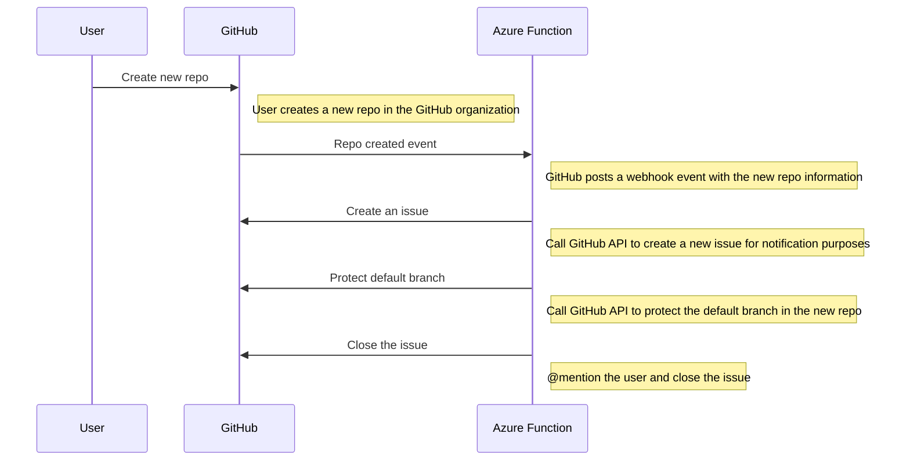
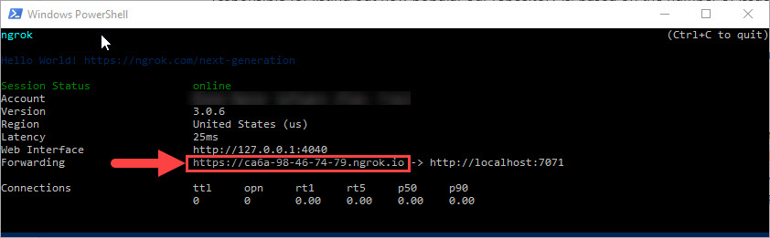

# GitHub branch protection policy

Apply branch protection settings to all new repositories within an organization.

## Solution overview



## Implementation approach

Azure Functions provide an ideal serverless hosting environment for processing webhook events with an easy setup and a cost-effective consumption-based pricing model.

These open-source libraries were used to further simplify GitHub API interactiions and parsing of the webhook payload objects.

- [Octokit](https://github.com/octokit/octokit.net)
- [Octokit.Webhooks](https://github.com/octokit/webhooks.net)

## Getting started

1. Navigate to _Settings_ > _Developer settings_ > _Personal access tokens_ and generate a new personal access token scoped to allow _Full control of private repositories_.

2. Create a [local.settings.json](https://docs.microsoft.com/en-us/azure/azure-functions/functions-develop-local#local-settings-file) file in [GitHubOrgPolicy](./src/GitHubOrgPolicy) and set the `GitHubAuthToken` and `GitHubUser` values.
```
{
  "IsEncrypted": false,
  "Values": {
    "AzureWebJobsStorage": "UseDevelopmentStorage=true",
    "FUNCTIONS_WORKER_RUNTIME": "dotnet",
    "GitHubAuthToken": "<personal-access-token-from-step-above>",
    "GitHubUser": "<your-github-username>"
  }
}
```
3. Open the project in Visual Studio and launch the application. Make a note of the local port number.

4. Download and launch [ngrok](https://ngrok.com/) with `ngrok http 7071`. Make a note of the url.

5. Navigate to the organization's _Settings_ > _Webhooks_ and register a new webhook. Set _Payload URL_ to `<ngrok-url-from-step-above>/api/RepoCreatedWebhook`, _Content type_ to `application/json` and select _Let me select individual events_ > _Repositories_.


6. Create a new repository within the organization. Navigate to repository _Settings_ > _Branches_ and verify that a branch protection rule was automatically created for the default branch.


## Deployment instructions

1. Deploy the Azure Function by following the [Continuous delivery by using GitHub Action](https://docs.microsoft.com/en-us/azure/azure-functions/functions-how-to-github-actions).
2. Set the `GitHubAuthToken` and `GitHubUser` application settings

3. Copy the function URL

4. Update the webhook _Payload URL_

5. Create another repository within the organization and verify the functionality.

## Additional considerations

- Submit a feature request to the product team to allow configuring certain repository settings at the organization level and having all repos inherit these settings, similar to [Cross-repo branch policies](https://docs.microsoft.com/en-us/azure/devops/repos/git/repository-settings?view=azure-devops&tabs=browser#cross-repo-branch-policies) in Azure DevOps.
- Run a one-time update to enable branch protection for existing repositories.
- Subscribe to the [branch_protection_rule](https://docs.github.com/en/developers/webhooks-and-events/webhooks/webhook-events-and-payloads#branch_protection_rule) event to audit and correct rule changes after the initial repo configuration.
